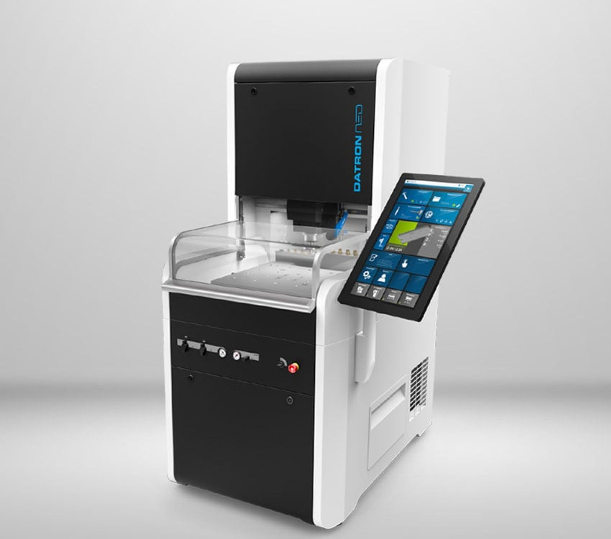

# Introduction to the machine

---
The Datron Neo is a prosumer high-speed 3-axis CNC-controlled milling machine, primarily aimed at precision machining plastic and soft metal parts with high dimensional accuracy, for hobbyist and semi-industrial use alike.

## Before Beginning

Please ensure you meet the following prerequisites to begin training on the Datron Neo:
- [x] General Safety Training
- [x] [Enroll in the Terrapin Works Canvas](https://shib.idm.umd.edu/shibboleth-idp/profile/SAML2/Redirect/SSO?execution=e1s1)
- [x] Complete IFL: Technician I Trainings
- [x] Install Autodesk Fusion360
- [x] Join the IFL Fusion Team + Datron Project folder
- [x] Create a training user folder (title should be your name)
