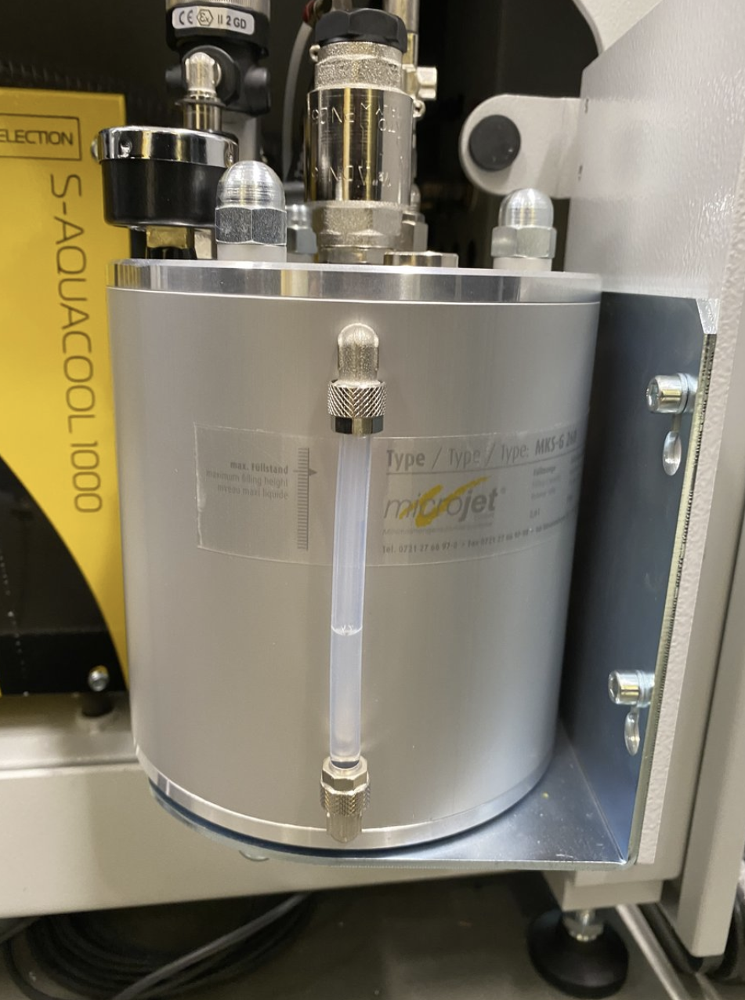

# Standard Operation Procedure
The Datron has an opening and closing task list that needs to be followed every day. These tasks help ensure that hardware and software systems on the Datron are kept in the best condition possible.

> [!TIP]
> It might be helpful to read the `Tooling` guide first

## Opening Procedure
- [ ] Turn on the power to the machine (switch is on the back)
- [ ] Grease the spindle, check the coolant level (Every Friday)
- [ ] Run the spindle warmup
  - press the play button in the top right corner

## Closing Procedure
- [ ] Park the spindle
  - Give the spindle rapid feed (middle dial)
  - Press the button labeled `park`
- [ ] Shutdown the Datron
  - Hold the `NEXT` button down and press shut down
- [ ] Turn off the power to the machine

## Greasing the Spindle
As the step says, this should be done every Friday at minimum.
- [ ] First, carefully remove the current tool from the spindle
- [ ] Remove the collet from the spindle using the wrench in the maintenance kit (located in the drawer labeled `maintenance`
- [ ] Apply a light layer of grease to the taper of the collet using the grease in the maintenance kit
- [ ] Re-screw the collet back in using the wrench
- [ ] Insert the tool back in

## Coolant
Checking the coolant should be done every Friday, with coolant top-off as needed.
- [ ] At the back of the Datron, on the bottom, there is a swiveling panel that has a canister attatched to it, this is where the coolant is stored. Make sure there is at least a quarter tank left

> Picture of the Canister

- [ ]
