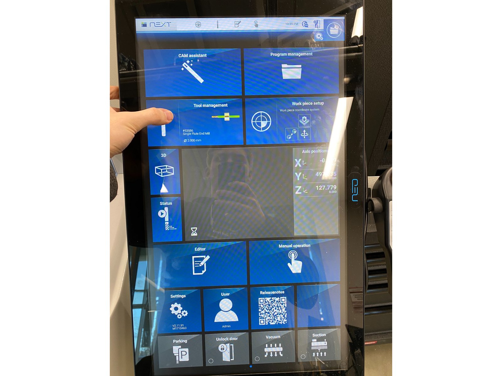

# Tooling

Machining in the IFL, you will become familiar with a large number of tools. In this guide, you will be learning about some of the more common tools that a CNC operator uses, and how we document and use tools in the IFL.
> [!NOTE]
> We often colloquially refer to CNC endmills and other cutting bits as "tools", not to be confused with other tools such as power tools.

## Types of Tools

### Endmills

Endmills are used to remove material either laterally, vertically, or both. They make very thin slices (chips) of material with a “flute” that has a very sharp blade along its edge. For the purposes of the Datron, we will talk about 2 endmills, because those are the only 2 types we use.
- **Flat Endmills**
  - As the name suggests, flat endmills have a flat bottom, or 0 corner radius, meaning that they leave a perfect 90 degree angle between the bottom of the cutting path and side of the cutting path
  - Datron Endmills are “single flute” - meaning that they have one chip evacuation flute, which has a singular cutting blade
- **Ball Endmills**
  - Ball endmills have a hemispherical bottom, with corner radius being determined by the diameter of the end mill
  - finishing `//TODO`

### Face mills

If you're participating in this training, then it's likely you've had some experience with the shell mill on the ProtoTrak. The shell mill is a kind of face mill. Face Mills are used to remove a large amount of vertical material from a face of the stock. They usually have a much wider diameter than normal end mills, but are not as deep.
> [!CAUTION]
> Do not use face mills for any other operation besides facing.

## Tool Dimensions

In fusion, when selecting a tool, you might notice words like flute length, or shoulder length that seem unfamiliar - these are critical dimensions that sometimes dictate the difference between a finished part and a crash. If you’ve already looked at a Datron endmill, you’ll notice that there are 2 distinct parts separated by a taper - the flute (the part that looks like a drill), and simply put, everything above the flute (shank)

### Lengths

- **Flute Length**
  - This is the cutting length of the tool - where the flute extends until the taper. Avoid cutting operations that exceed this dimension. It should be noted that there are some end mills where the flute seems to extend beyond this specified dimension - however, if you look closely, you’ll notice that the extra “flute length” has no cutting edge, and is much shallower in most cases - this segment is for chip evacuation and is not included in flute length
- **Shoulder Length**
  - If you’ve seen a Datron endmill, you’ll notice that they have a taper (sometimes small, sometimes large) that transitions from the diameter of the cutting end to the diameter of the shank. Everything from the end of the flute length until this taper is called the “shoulder”. The shoulder length of a tool is the flute length plus the extension until the taper
- **Length Below Holder**
  - This is the total stickout of the tool, or the length of the tool below either the adapter it’s in, or the length below the spindle itself
- **Overall Length**
  - Self-explanatory, this is the total length of the tool from end to end.

### Diameter

- **Diameter**
  - The diameter that this dimension refers to is the diameter of the tool at the cutting edge. Depending on the tool, this can be more, less, or equal to the diameter of the shaft
- **Shaft (Shank) Diameter**
  - The shaft diameter is the diameter of the shank of the tool, or part of the tool after the taper that is being clamped

> Visual aid

## Datron Tool System

Datron tools are a bit special compared to conventional CNC tooling, since the Datron is a non-conventional machine

### Adapters

- The Datron's collet system is standardized to work with 8mm shank diameters. However, if you've looked at a few Datron endmills, you'll notice that not all of the shafts are the same diameter. We can remedy this by using adapters, which will convert xmm to 8mm

### Rings

- For tools that are clamped directly by the spindle, and not using an adapter, we have to use stop rings. The reason for this is so that the tool is always level with the face of the collet, to ensure that the tool is level while cutting. There are 2 types of rings, the small diameter rings and the large diameter rings. The large diameter rings have multiple uses, and are locked in using a set screw. The small diameter rings are single-use, and are fit using a small press
> [!TIP]
> Adapters, rings, and their tools are located in the Husky toolchest to the left of the Datron.

# Fusion Tool Library

All CAM for the Datron will use tool definitions from the IFL team's cloud library. The library contains all the tools in the Datron, as well as all tools that we currently have on hand. It stores dimensions, presets for feeds and speeds, as well as presets for stepovers and stepdown cutting information. For most orders, you will be using tools from the library labeled "DATRON" (not "DATRON ALL CUTTING TOOLS" or anything like that, just "DATRON").

> [!IMPORTANT]
> To get to the IFL's fusion tool library, make sure you have `Preferences > Manufacture > Enable Cloud Libraries` enabled

## Presets

This topic will be covered briefly here, as it will be talked about a lot more in the video modules. We use presets as a quick way of setting the cutting parameters for different end mills instead of manually entering the information in line by line when programming operations.

### Partial Cut

Partial cut refers to operations that remove material with a fraction of the tool's total diameter. These operations are typically more aggressive in nature due to the fact that there is less contact between the tool and the stock, and thus less force is placed on the end mill.
> [!NOTE]
> Common operations that use partial cut include, but are not limited to, adaptives (2D & 3D), faces, pockets.

### Full Cut

Full cut refers to operations that remove material with the full diameter of the tool. These operations have to be more conservative, otherwise you run the risk of shearing the tool due to the amount of force you are applying perpendicular to the tool itself.
> [!NOTE]
> Common operations that use full cut include, but are not limited to, contours, bores.

## Adding Tools to the Library

The fusion tool library can be expanded by any user who has access to the IFL cloud library. To add a tool, click on the plus icon in the top left, and choose the type of tool you are trying to add to the system.

## General

The only field that you have to fill out here is the "Description" field. The format should be as follows: `[MATERIAL] <TOOL TYPE>`.

> Tool description example format

## Cutter

Here you should be filling out the dimenions of the tool. All the dimensions were just defined above, so feel free to consult them.
> [!NOTE]
> Make sure that your units are mm and that clockwise spindle rotation is checked. Datron endmills are Carbide as well, so make sure to select that for the material.

## Shaft

You shouldn't have to fill this area out.

## Holder

Select the default holder from "Holders (Metric)".

## Cutting Data

Create 2 presets using the plus icon in the top left, name them partial cut and full cut (if you haven't learned about these, you will soon).

The majority of the information in this section can be filled out from the [tool speed calculator][1] in the shared google drive. The fields with the `fx` on the right don't need to be filled out - that `fx` stands for function - those parameters are determined by what's input in the other fields. Some of the parameter names aren't one-to-one with the names in the calculator, so I'll clarify below:

`<Fusion> -- <Calculator>`
- Spindle Speed -- RPM
- Cutting Feedrate -- Feedrate XY
- Stepover -- Depth of Cut
- Stepdown -- Width of Cut
- Plunge Feedrate -- Feedrate Z

A few more notes:
- Ramp feedrate can be set to be half the cutting feedrate
- In each preset make sure to select the boxes for stepdowns and stepovers - fill those values in from the calculator as well
- Coolant should be set to mist by default

# Datron Tool Management UI

To locate the UI, tap the `NEXT` button at the top right of the Datron's control panel, then tap the box that says "Tool Management".

> Visual guide

## Tool Info

Each tool "display" has information about the tool, such as tool diameter, flute length, and overall length. Each tool will have 4-5 buttons underneath that correspond to actions that can be made on the tool. The actions depend on where the tools are located, for example, a tool in the spindle has different actions than a tool not in the machine at all.

## Spindle

This section of the UI just shows information about the current tool in the spindle. 
`//TODO`

## Tool Magazine

`//TODO`

## Warehouse

`//TODO`

## User Tool Catalogue

`//TODO`

## DATRON Tool Catalogue

`//TODO`

# Adding and Removing Tools (Machine)

`//TODO`

[1]: <https://drive.google.com/drive/folders/1qK4v8owg6VsG17WGy4iM4AYyfFKU4zLS>
