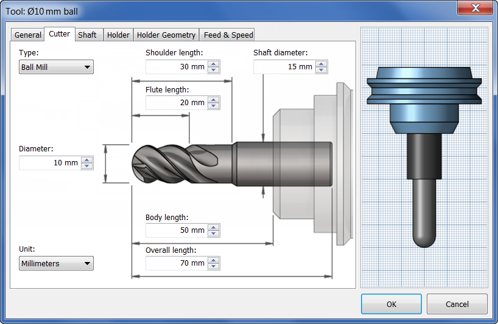

# Tooling

Machining in the IFL, you will become familiar with a large number of tools. In this guide, you will be learning about some of the more common tools that a CNC operator uses.

## Types of Tools

- **Endmills**
  - Endmills are used to remove material either laterally, vertically, or both. They make very thin slices (chips) of material with a “flute” that has a very sharp blade its edge. For the purposes of the Datron, we will talk about 2 endmills, because those are the only 2 types we use  
  - **Flat Endmills**
    - As the name suggests, flat endmills have a flat bottom, or 0 corner radius, meaning that they leave a perfect 90 degree angle between the bottom of the cutting path and side of the cutting path
    - Datron Endmills are “single flute” - meaning that they have one chip evacuation flute, which has a singular cutting blade
  - **Ball Endmills**
    - Ball endmills have a hemispherical bottom, with corner radius being determined by the diameter of the end mill
    - Ball endmills are typically used to finish parts, `//TODO`
- **Face Mills**
  - If you're participating in this training, then it's likely you've had some experience with the shell mill on the trak. The shell mill is a kind of face mill
  - Face Mills are used to remove a large amount of vertical material from a face of the stock
  - They usually have a much wider diameter than normal end mills, but are not as deep
  - Good for operations that just work with a single face (in fusion called “face”), not much else

## Tool Dimensions

- In fusion, when selecting a tool, you might notice words like flute length, or shoulder length that seem unfamiliar - these are critical dimensions that sometimes dictate the difference between a finished part and a crash. If you’ve already looked at a Datron endmill, you’ll notice that there are 2 very distinct parts - the flute, and simply put, everything above the flute (shank)
- **Lengths**
  - **Flute Length**
    - This is the cutting length of the tool - where the flute extends until the taper. Avoid cutting operations that exceed this dimension. It should be noted that there are some end mills where the flute seems to extend beyond this specified dimension - however, if you look closely, you’ll notice that the extra “flute length” has no cutting edge, and is much shallower in most cases - this segment is for chip evacuation and is not included in flute length
  - **Shoulder Length**
    - If you’ve seen a Datron endmill, you’ll notice that they have a taper (sometimes small, sometimes large) that transitions from the diameter of the cutting end to the diameter of the shank. Everything from the end of the flute length until this taper is called the “shoulder”. The shoulder length of a tool is the flute length plus the extension until the taper
  - **Length Below Holder**
    - This is the total stickout of the tool, or the length of the tool below either the adapter it’s in, or the length below the spindle itself
  - **Overall Length**
    - Self-explanatory, this is the total length of the tool from end to end.
- **Diameter**
  - **Diameter**
    - The diameter that this dimension refers to is the diameter of the tool at the cutting edge. Depending on the tool, this can be more, less, or equal to the diameter of the shaft
  - **Shaft (Shank) Diameter**
    - The shaft diameter is the diameter of the shank of the tool, or part of the tool after the taper that is being clamped

## Datron Tool System

- Datron tools are a bit special compared to conventional CNC tooling, since the Datron is a non-conventional machine
- ** Adapters and Rings **
  - The Datron's collet system is standardized to work with 8mm shank diameters. However, if you've looked at a few Datron endmills, you'll notice that not all of the shafts are the same diameter. We can remedy this by using adapters (usually located in the drawer labeled "Datron Tools in Containers"), which will convert xmm to 8mm. You will have to use a tool located in the "Tool Change & Brushes" drawer
  - For tools that are clamped directly by the spindle, and not using an adapter, we have to use stop rings. The reason for this is so that the tool is always level with the face of the collet, to ensure that the tool is level while cutting. There are 2 types of rings, the small diameter rings and the large diameter rings. The large diameter rings have multiple uses, and are locked in using a set screw. The small diameter rings are single-use, and are fit using a small press located in the "Tool Change & Brushes" drawer
 
# Fusion Tool Library

